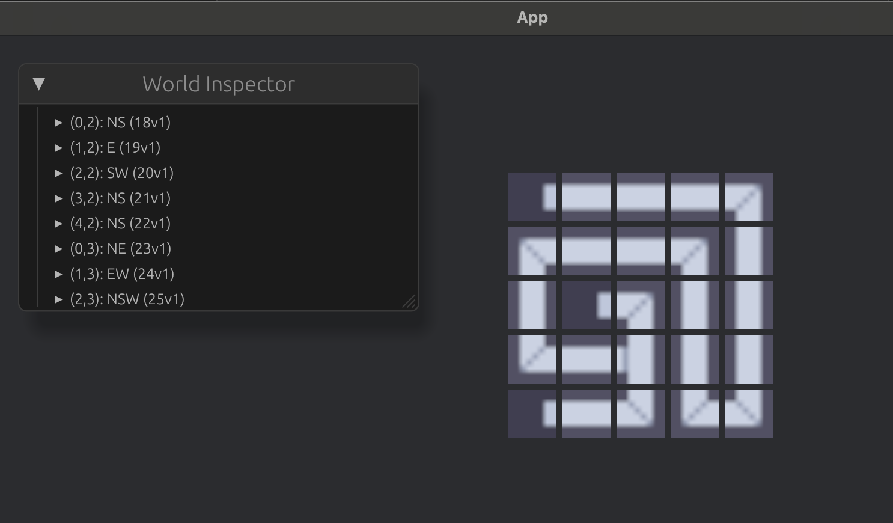

[](https://crates.io/crates/knossos)
[](https://opensource.org/licenses/Apache-2.0)
[](https://github.com/naomijub/bevy_knossos/actions/workflows/build.yml)
[](https://coveralls.io/github/naomijub/bevy_knossos)

<p align="center">
  
</p>

# Bevy_Knossos

Bevy_Knossos is a fork from [knossos](https://github.com/unrenamed/knossos) Rust library and CLI for maze generation, but with focus on Bevy development. It is complete with fundamental functions for rendering and saving mazes to files.

## Reference for [Knossos Library](https://github.com/unrenamed/knossos)

In Greek mythology, King Minos dwelt in a palace at Knossos. He hired the Athenian architect, mathematician, and inventor Daedalus to design his palace and so cleverly was it constructed that no one who entered could find their way back out without a guide. In other versions of this same story it was not the palace itself which was designed in this way but the labyrinth within the palace which was built to house the half-man/half-bull the Minotaur. In order to keep Daedalus from telling the secrets of the palace, Minos locked him and his son Icarus in a high tower at Knossos and kept them prisoner. Daedalus fashioned wings made of wax and bird's feathers for himself and his son, however, and escaped their prison but Icarus, flying too close to the sun, melted his wings and fell to his death. 

Source: https://www.worldhistory.org/knossos

## Overview

Bevy_Knossos currently supports only one type of mazes: **orthogonal**, which is a standard maze layout of rectangular passages. If you only want a Rust Maze library, checkout [Knossos Library](https://github.com/unrenamed/knossos).

The library supports the following generation algorithms:

* [Aldous-Broder](https://weblog.jamisbuck.org/2011/1/17/maze-generation-aldous-broder-algorithm)
* [Binary Tree](https://weblog.jamisbuck.org/2011/2/1/maze-generation-binary-tree-algorithm)
* [Eller's](https://weblog.jamisbuck.org/2010/12/29/maze-generation-eller-s-algorithm)
* [Growing Tree](https://weblog.jamisbuck.org/2011/1/27/maze-generation-growing-tree-algorithm)
* [Hunt-and-Kill](https://weblog.jamisbuck.org/2011/1/24/maze-generation-hunt-and-kill-algorithm)
* [Kruskal's](https://weblog.jamisbuck.org/2011/1/3/maze-generation-kruskal-s-algorithm)
* [Prim's](https://weblog.jamisbuck.org/2011/1/10/maze-generation-prim-s-algorithm)
* [Recursive Backtracking](https://weblog.jamisbuck.org/2010/12/27/maze-generation-recursive-backtracking)
* [Recursive Division](https://weblog.jamisbuck.org/2011/1/12/maze-generation-recursive-division-algorithm)
* [Sidewinder](https://weblog.jamisbuck.org/2011/2/3/maze-generation-sidewinder-algorithm)

[Knossos Library](https://github.com/unrenamed/knossos) supports the following output types:

* **ASCII** With the ASCII output option, you can effortlessly display a maze on the console or save it to a file to visualize its appearance.

* **Game map** If you are looking to create your own game featuring pseudo 3D graphics or testing your ray casting algorithm implementation, you can transform a maze into a game map using this formatter. It offers various configuration options, including the `span` value for specifying the distance between opposing walls, the characters `wall` and `passage` for map construction, and the ability to randomly place start `S` and goal `G` points along the borders.

* **Image** Utilizing the Image output feature, you have the capability to render a maze into PNG or JPG formats (simply utilize the appropriate filename extension). This output type offers extensive customization options, enabling you to define custom margins, wall and passage widths, as well as background and foreground colors.

## Installation
Run the following Cargo command in your project directory:
```no_test
cargo add bevy_knossos
```

Or add the following line to your `Cargo.toml`:
```no_test
[dependencies]
bevy_knossos = "0.5.0"
```

## Usage

For information on knossos CLI usage, check the original repository [#Cli](https://github.com/unrenamed/knossos?tab=readme-ov-file#cli) or [#Usage](https://github.com/unrenamed/knossos?tab=readme-ov-file#usage). 

> Crates may have diverged

### Bevy Usage


## Bevy Mini-maze under Kenney.nl license and APACHE:


> Resulting Maze with Bevy

```rust
use bevy::{prelude::*, utils::HashMap};
use bevy_knossos::{maze::*, Coords, CoordsComponent};

fn main() {
    let maze = OrthogonalMazeBuilder::new()
        .algorithm(Box::new(RecursiveBacktracking))
        .width(5)
        .height(5)
        .build()
        .unwrap();

    App::new()
        .insert_resource(maze)
        .add_plugins(DefaultPlugins)
        .add_systems(Startup, load_assets)
        .add_systems(PostStartup, setup.after(load_assets))
        .run();
}

#[derive(Clone, Debug, Reflect, Resource, Default)]
pub struct TilesHandles {
    map: HashMap<String, Handle<bevy::image::Image>>
}

fn load_assets(mut commands: Commands, asset_server: Res<AssetServer>) {
    let mut tiles = TilesHandles::default();
    let images = vec![
        "tile_0000.png",
        "tile_0001.png",
        "tile_0010.png",
        "tile_0011.png",
        "tile_0100.png",
        "tile_0101.png",
        "tile_0110.png",
        "tile_0111.png",
        "tile_1000.png",
        "tile_1001.png",
        "tile_1010.png",
        "tile_1011.png",
        "tile_1100.png",
        "tile_1101.png",
        "tile_1110.png",
        "tile_1111.png",
    ];

    for image in images {
        let handle = asset_server.load(image);
        tiles.map.insert(image.to_string(), handle);
    }
    commands.insert_resource(tiles);
}

fn setup(mut commands: Commands, maze: Res<OrthogonalMaze>, tiles: Res<TilesHandles>) {

    commands.spawn((
        Camera2d,
        Name::new("Camera"),
    ));

    for (coords, cell) in maze.iter() {
        let bundle = load_image(&coords, cell, &tiles);
        commands.spawn(bundle);
    }
}

fn load_image(coords: &Coords, cell: &Cell, tiles: &Res<TilesHandles>) -> (
    CoordsComponent,
    Cell,
    Sprite,
    Name,
    Transform
) {
    let cell_sprite = format!("tile_{}.png", cell.to_bits_str());
    let sprite = Sprite::from_image(tiles.map.get(&cell_sprite).expect("All tiles should have been registered").clone());
    let name = Name::new(format!("({},{}): {}", coords.0, coords.1, cell));
    let position = Transform::from_xyz(coords.0 as f32 * 45., (5 - coords.1) as f32 * 45., 0.)
        .with_scale(Vec3::from_slice(&[5., 5., 0.1]));

    (coords.to_owned().into(), *cell, sprite, name, position)
}
```

<details>
<summary> kenny.nl CC0 Minimap Pack License </summary>
Minimap Pack (1.0)

Created/distributed by Kenney (www.kenney.nl)
Creation date: 05-11-2024

------------------------------

License: (Creative Commons Zero, CC0)
http://creativecommons.org/publicdomain/zero/1.0/

This content is free to use in personal, educational and commercial projects.

Support us by crediting Kenney or www.kenney.nl (this is not mandatory)

------------------------------

Donate:   http://support.kenney.nl
Patreon:  http://patreon.com/kenney/

Follow on Twitter for updates:
http://twitter.com/KenneyNL
</details>